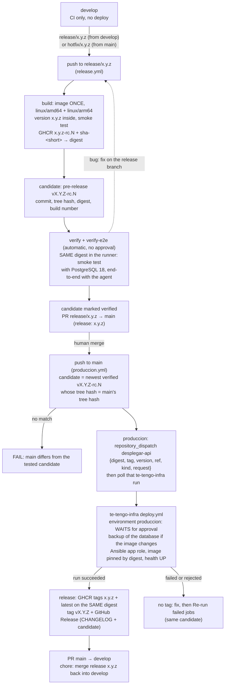

# Deployment: container image

The API ships as one container image, built by the [`Dockerfile`](../Dockerfile) and published to the GitHub Container Registry as `ghcr.io/te-tengo-tech/te-tengo-general-api`. The server setup (one Azure VM with Docker Compose: Caddy with TLS, PostgreSQL, MediaMTX; clips in Cloudflare R2) lives in `te-tengo-infra`; this document covers the image and how a release reaches that server.

## The image
- **Two stages.** A Temurin 25 JDK stage runs `./gradlew bootJar` and splits the jar into Spring Boot layers. The runtime stage is Temurin 25 **JRE** with one image layer per Spring Boot layer (dependencies, loader, snapshots, application), so a new release usually only pulls the small application layer.
- **Platforms.** `linux/amd64` (the production Azure VM) and `linux/arm64` (the inactive OCI Ampere and AWS Graviton alternatives of `te-tengo-infra`). The build stage runs on the build machine's platform, since the jar is platform independent, so a multi-platform build compiles once.
- **Non-root.** It runs as user `tetengo` (uid/gid `10001`) from `/app`.
- **Health.** Port `8080`. The image `HEALTHCHECK` probes `/actuator/health/liveness`; readiness is `/actuator/health/readiness`. The JRE image has neither curl nor wget, so the probe uses bash's `/dev/tcp`.
- **Memory.** `JAVA_TOOL_OPTIONS` sizes the heap at 75 % of the container memory limit and exits on `OutOfMemoryError`, so the restart policy brings it back. Override the variable to tune it.

## Running it
The configuration is the same set of environment variables listed in the [README](../README.md#configuration), plus Spring Boot's standard datasource variables. The JWT keys are files: mount them read-only and point to them.

```bash
docker build -t te-tengo-general-api .
docker run --rm -p 8080:8080 \
  -v "$PWD/.claves:/run/secrets/tetengo:ro" \
  -e TT_JWT_CLAVE_PUBLICA=file:/run/secrets/tetengo/publica.pem \
  -e TT_JWT_CLAVE_PRIVADA=file:/run/secrets/tetengo/privada.pem \
  -e SPRING_DATASOURCE_URL=jdbc:postgresql://<host>:5432/tetengo \
  -e SPRING_DATASOURCE_USERNAME=tetengo -e SPRING_DATASOURCE_PASSWORD=<password> \
  te-tengo-general-api
curl localhost:8080/actuator/health
```

- **Key permissions.** The container user (uid 10001) must be able to read the mounted keys: `chmod 644`, or `chown 10001` with `chmod 600`.
- **Without storage, e-mail or push variables,** clips use the in-memory fake and e-mail and push only log. Set `TT_CLIPS_*` (Amazon S3 or [Cloudflare R2](#clips-on-cloudflare-r2)), the e-mail provider (`TT_CORREO_PROVEEDOR=ses` with `TT_SES_*`, or `smtp` with `TT_SMTP_REMITENTE` and `SPRING_MAIL_*`, see [NOTIFICATIONS.md](NOTIFICATIONS.md#e-mail)), `TT_PUSH_PROVEEDOR` and its variables for the real services. On EC2, leave the AWS access keys blank: the AWS SDK picks up the instance role.
- **For the PWA** (the app's web build, e.g. on Cloudflare Pages or a custom domain): `TT_CORS_ORIGENES=https://te-tengo.pages.dev` (an origin, without the path), `TT_ENLACE_BASE=https://te-tengo.pages.dev/app/#`, `TT_PWA_URL=https://te-tengo.pages.dev/app/` and, with `sns`, `TT_SNS_ARN_WEB`. Outside this image, MediaMTX needs `MTX_HLSALLOWORIGINS=https://te-tengo.pages.dev` and the clips bucket a CORS rule for the same origin (`clips_cors_allowed_origins` in `te-tengo-infra`), since the browser reads both from another origin.
- **Against a local stack** (PostgreSQL and Floci on a Docker network), point the endpoints at the Floci container: `TT_CLIPS_ENDPOINT=http://floci:4566`, `TT_CLIPS_PATH_STYLE=true`, `TT_CLIPS_ACCESS_KEY=test`, `TT_CLIPS_SECRET_KEY=test`, `TETENGO_CLIPS_S3_CREARBUCKET=true`. Pre-signed URLs then use the `floci` host name, which only containers on that network resolve.

## Clips on Cloudflare R2
The S3 adapter works with [Cloudflare R2](https://developers.cloudflare.com/r2/) through R2's S3 API, configured as Cloudflare's [AWS SDK for Java example](https://developers.cloudflare.com/r2/examples/aws/aws-sdk-java/) does: region `auto` and the account's S3 endpoint. Clips still never pass through the API: the agent uploads with a pre-signed PUT URL (10 minutes) and the app reads with a pre-signed GET URL (5 minutes). R2 accepts pre-signed URLs that last from 1 second to 7 days ([Presigned URLs](https://developers.cloudflare.com/r2/api/s3/presigned-urls/)).

```bash
TT_CLIPS_BUCKET=te-tengo-clips
TT_CLIPS_REGION=auto
TT_CLIPS_ENDPOINT=https://<ACCOUNT_ID>.r2.cloudflarestorage.com
TT_CLIPS_PATH_STYLE=true
TT_CLIPS_ACCESS_KEY=<R2 API token access key ID>
TT_CLIPS_SECRET_KEY=<R2 API token secret access key>
```

- **Credentials.** Create an R2 API token with object read and write permission on the bucket and keep its keys in the server's secrets, never in the repository. The API only presigns, checks that a clip exists (`HeadObject`) and deletes clips; leave `crear-bucket` off and create the bucket in Cloudflare.
- **Endpoint.** Pre-signed URLs only work on the S3 API domain `<ACCOUNT_ID>.r2.cloudflarestorage.com`, not on a custom domain of the bucket ([Presigned URLs](https://developers.cloudflare.com/r2/api/s3/presigned-urls/)). The agent and the app reach it directly.
- **Checksums.** No extra SDK setting is needed. The pre-signed PUT URL signs only `Content-Type` and `Host` and carries no SDK checksum parameters, so the agent's plain PUT with the returned `Content-Type` header matches the signature; `AlmacenamientoDeClipsConfigTest` keeps that true across SDK upgrades. (Cloudflare's example disables chunked encoding for `PutObject` sent through the SDK client; the API never uploads through the client.)
- **CORS for the PWA.** The PWA reads clips from another origin, so the bucket needs a CORS policy for the PWA's origin ([Configure CORS](https://developers.cloudflare.com/r2/buckets/cors/)). In the dashboard (R2 > the bucket > Settings > CORS Policy), for example:
  ```json
  [
    {
      "AllowedOrigins": ["https://te-tengo.pages.dev"],
      "AllowedMethods": ["GET", "HEAD", "PUT"],
      "AllowedHeaders": ["Content-Type", "Range"],
      "ExposeHeaders": ["ETag"],
      "MaxAgeSeconds": 3600
    }
  ]
  ```
  `GET` and `HEAD` play and download clips; `PUT` with `Content-Type` covers a pre-signed upload from a browser (the household agent is not a browser, so CORS does not apply to it). Wrangler applies the same rule with `npx wrangler r2 bucket cors set <BUCKET_NAME> --file cors.json`, in its own file format (see the Cloudflare page).
- **Locally nothing changes:** the `local` profile keeps Floci's S3 on port 4566.

## Release flow (build once, deploy many)
Releases follow git flow with **release candidates** ("Model C, tag at the end"): the image is built **once** on the release branch as a candidate `x.y.z-rc.N`, that same image (by digest) is verified, and after the release pull request is merged, **`main` deploys exactly that digest** to production. The tag `vX.Y.Z` and the GitHub Release come **last**, only after production succeeded. `develop` deploys nothing. The API has **no staging target** (there is no second VM): the candidate's verification is automatic, and production has the only approval, on `te-tengo-infra`'s `produccion` environment.



| Trigger | Workflow | What happens |
|---|---|---|
| Pull request, push to `develop`, `main`, `release/**`, `hotfix/**` | [`ci.yml`](../.github/workflows/ci.yml) | Tests, architecture, format, coverage. Pushes to release branches and `main` too, because a pull request opened with `GITHUB_TOKEN` starts no `pull_request` run and the `main` ruleset requires the checks on the head commit |
| Pull request touching the image inputs | [`image.yml`](../.github/workflows/image.yml) | Builds the amd64 image and smoke-tests it ([`scripts/smoke-image.sh`](../scripts/smoke-image.sh): it must migrate an empty PostgreSQL 18, report healthy and not run as root), then builds both platforms. Nothing is pushed |
| Manual run (*Actions → Container image → Run workflow*) | `image.yml` | Same build; with **push** checked (and `ENABLE_API_IMAGE` on), pushes `sha-<short commit>` and `<branch>` for tests. Never deployed by itself |
| **Push to `release/x.y.z` or `hotfix/x.y.z`** | [`release.yml`](../.github/workflows/release.yml) | Builds, records and verifies the candidate `x.y.z-rc.N`, then opens or updates the pull request to `main` |
| **Push to `main`** (the merged release or hotfix pull request) | [`produccion.yml`](../.github/workflows/produccion.yml) | Finds the verified candidate by tree hash, deploys its digest through `te-tengo-infra` and waits for the result, then tags `x.y.z` + `latest` and `vX.Y.Z`, and opens the back-merge |
| Manual run (*Actions → Rollback → Run workflow*, from `main`) | [`rollback.yml`](../.github/workflows/rollback.yml) | Deploys the digest of an earlier final release `vX.Y.Z` (see [Rollback](#rollback)) |

### Release branch: the candidate (`release.yml`)
| Job | Environment | What it does |
|---|---|---|
| `build` | none | Reads `version` from `build.gradle.kts` (a warning if the branch name differs) and picks **N** = 1 + the highest existing candidate of that version (tags `vX.Y.Z-rc.*`; a number already taken in GHCR is skipped, so no candidate is ever overwritten). Builds the image **once** for both platforms with the final version inside (`org.opencontainers.image.version=x.y.z`; "rc" only lives in the tag), smoke-tests the amd64 image and pushes it to `ghcr.io/te-tengo-tech/te-tengo-general-api` as `x.y.z-rc.N` and `sha-<short commit>`. The **digest** identifies the candidate from here on |
| `candidate` | none | Creates the GitHub **pre-release** `vX.Y.Z-rc.N` (tag on the release commit) whose notes record the commit, the git tree hash (`git rev-parse HEAD^{tree}`), the image and digest, the build number (the workflow run number) and `verification=pending`. GHCR and GitHub Releases keep it for good; Actions artifacts would expire |
| `verify` | none, no approval | An **ephemeral run in the runner**: pulls the candidate **by digest** (and checks the digest), starts it with PostgreSQL 18 and runs the smoke test |
| `verify-e2e` | none | Calls [`e2e.yml`](../.github/workflows/e2e.yml) with that image: `scripts/e2e.sh` with `TT_E2E_IMAGEN` runs the API container on the host network next to the `compose.yaml` stack (PostgreSQL, Floci, MediaMTX) and the real desktop agent, headless, and asserts the alert, its push, its confirmation, its clip and the live view authorization |
| `pull-request` | none | Marks the pre-release `verification=passed`, then opens the pull request `release/x.y.z → main` (title `release: x.y.z`) with `GITHUB_TOKEN`, whose body names the candidate, digest, tree hash and verification; or updates the body when it is already open |

- **A bug found in the candidate** is fixed on the release branch (directly or with a `bugfix/*` pull request into it). The next push builds `rc.N+1` and updates the pull request; earlier candidates stay as they were. The version does not change.
- **Preparing a release.** Branch `release/x.y.z` from `develop`, set `version = "x.y.z"` in `build.gradle.kts` and rename `[Unreleased]` in `CHANGELOG.md` to `[x.y.z] - <date>` (that section becomes the release notes), push. A **hotfix** branches from `main` as `hotfix/x.y.z` (a higher patch version) and follows the same pipeline.
- **Re-running.** Runs of one branch never overlap (concurrency group per branch) and a running one is never cancelled; a newer push waits and replaces an older run that has not started yet.

### Main: production and the tag (`produccion.yml`)
| Job | Environment | What it does |
|---|---|---|
| `candidate` | none | Reads the version and finds the **approved candidate**: the newest pre-release `vX.Y.Z-rc.N` with `verification=passed` whose recorded tree hash equals `git rev-parse HEAD^{tree}` of `main`. If none matches, the run **fails**: "main differs from the tested candidate; push the change to the release branch to build a new rc" (for example, a hotfix reached `main` while the release was being tested). If `vX.Y.Z` already tags this commit, nothing is left to do; if it tags another commit, the version must be raised |
| `produccion` | none here; **`produccion` in te-tengo-infra** | Switch `ENABLE_API_DEPLOY`. Checks that the digest is in GHCR, sends `repository_dispatch` `desplegar-api` to `te-tengo-infra` and **waits for that deployment** ([`.github/scripts/request-deploy.sh`](../.github/scripts/request-deploy.sh)). It succeeds only if the infra run succeeded and its deploy job really ran |
| `release` | none | Only if every enabled production job succeeded: adds the tag `x.y.z` (immutable: refused if it points elsewhere) and, after a deploy, `latest` to the **same digest** (`docker buildx imagetools create`, no rebuild), then creates the tag `vX.Y.Z` on the `main` commit and its GitHub Release (marked latest): the `CHANGELOG.md` section, the candidate it came from and a `digest=` line that [Rollback](#rollback) reads |
| `back-merge` | none | Opens the pull request `main → develop` (`chore: merge release x.y.z back into develop`) when `main` has commits that `develop` lacks |

- **How the API learns the deploy result.** The infra workflow names a dispatched run after the payload's `request` (`api <run id>.<attempt>`), so the `produccion` job finds that run with `DISPATCH_TOKEN` and polls it every 30 s (`gh run view`; only state changes are logged) until it completes, through the approval wait. Polling was chosen over a callback from infra because it needs no second token and no extra workflow in this repository. The job may wait up to 6 hours (the limit of a GitHub-hosted job); if it runs out while the approval is pending, **Re-run failed jobs** resumes watching the same infra run instead of requesting a second deploy.
- **Production failed or was rejected:** no `x.y.z`/`latest` tag, no `vX.Y.Z`. Fix the cause (or approve it this time) and use **Re-run failed jobs**: the same candidate is requested again, nothing is rebuilt.
- **`latest` names the image in production.** It moves only after a successful deploy (and on a rollback). With `ENABLE_API_DEPLOY` off, the release is still tagged `vX.Y.Z` and `x.y.z` (no enabled production job failed), the summary and the notes say it was not deployed, and `latest` stays where it was. te-tengo-infra verifies its own releases against `latest`.
- **Concurrency.** `produccion.yml` and `rollback.yml` share the group `produccion`: one production change at a time, never cancelled.

### Rollback
*Actions → Rollback → Run workflow* (from `main`) with `version` = an earlier final release, e.g. `0.2.0`. It reads the `digest=` line of the GitHub Release `v0.2.0`, sends `desplegar-api` with that digest (`kind: rollback`; approval on te-tengo-infra's `produccion`), waits for the result like the `produccion` job and then moves `latest` back to that digest. Nothing is built. Candidates (`-rc.N`) cannot be rolled back to.
- **Database.** Flyway migrations are forward-only, and the older image may refuse a schema that a newer release migrated. te-tengo-infra takes a database backup **before every deploy that changes the image**, so restore the dump taken right before the bad release (`te-tengo-restore`, te-tengo-infra `docs/deploy.md`, *Rollback*), then run the rollback.
- Then fix forward with a `hotfix/x.y.(z+1)`.

### Switches
Each stage has an on/off switch: an **organization** Actions variable of `Te-Tengo-Tech` (*Settings → Secrets and variables → Actions → Variables*), the single control panel for every repository. They are explicit opt-in: only the value `true` turns a stage on, and an unset variable means off. The pull request build and smoke test always run, and the verification jobs have no switch: they always run when there is a candidate.

| Variable | What it controls | Suggested value |
|---|---|---|
| `ENABLE_API_IMAGE` | Pushing new images to GHCR: the release candidate (and the manual push of `image.yml`). Off: the release branch only builds and smoke-tests, so there is **no candidate**: no verification, no pull request to `main`, and a push to `main` finds nothing to promote. Re-tagging an existing candidate on `main` is part of production and is not gated by it | `true` |
| `ENABLE_API_DEPLOY` | The `produccion` job of `produccion.yml` and the rollback. `te-tengo-infra` gates its `Deploy` job with the same variable, so anything but `true` freezes production | `true` |

## Production deploy (main → approval in te-tengo-infra → Azure VM)
```
produccion.yml produccion: repository_dispatch "desplegar-api" to Te-Tengo-Tech/te-tengo-infra,
  client_payload {"digest": "sha256:...", "tag": "x.y.z-rc.N", "version": "x.y.z", "ref": "<main commit>",
                  "kind": "release", "request": "api <run id>.<attempt>"}
    └─ te-tengo-infra deploy.yml (on its main branch), run "... [api <run id>.<attempt>]":
       plan (digest exists in GHCR) ─► deploy job in environment "produccion" ─► waits for a required reviewer
       ─► Ansible app role over SSH: pulls ghcr.io/...:x.y.z-rc.N@sha256:..., dumps the database first when the
          image differs from the running one (te-tengo-backup), starts it ─► /actuator/health is UP
    └─ request-deploy.sh polls that run until it completes; success → x.y.z, latest, vX.Y.Z
```
- **Approval lives in `te-tengo-infra`.** The deploy happens there, so the `produccion` job here uses no GitHub environment; this repository's `produccion` environment would only add a second, redundant approval of the same deploy.
- **Secret `DISPATCH_TOKEN`** (repository secret of this repository). A [fine-grained personal access token](https://docs.github.com/en/authentication/keeping-your-account-and-data-secure/managing-your-personal-access-tokens#creating-a-fine-grained-personal-access-token): resource owner **Te-Tengo-Tech**, *Only select repositories* → `te-tengo-infra`, repository permissions **Contents: Read and write** (required by [`POST /repos/{owner}/{repo}/dispatches`](https://docs.github.com/en/rest/repos/repos#create-a-repository-dispatch-event), per [Permissions required for fine-grained personal access tokens](https://docs.github.com/en/rest/authentication/permissions-required-for-fine-grained-personal-access-tokens)) and **Actions: Read** (to find and poll the Deploy run); *Metadata: Read* is added automatically. Set an expiry and renew it. If the organization requires approval of fine-grained tokens, an owner approves it first. Without the secret, or without one of the permissions, the `produccion` job fails with an error that says which; fix it and re-run the failed jobs.
- **The infra workflow must be on infra's `main`.** GitHub only starts a `repository_dispatch` workflow from the file on the default branch, and runs it on that branch ([Events that trigger workflows](https://docs.github.com/en/actions/reference/workflows-and-actions/events-that-trigger-workflows#repository_dispatch)).
- **Identity.** The digest travels from the build to production: the candidate's notes record it, verification pulls it by digest, the host pins it (`name:tag@sha256:…`), and the final tags are added to it. The tree hash ties the candidate to `main`'s content.

### One-time steps after the first push
1. **Check the link to this repository.** The `org.opencontainers.image.source` label links the package automatically: check the package page under the organization's *Packages* tab.
2. **Make the package public, once.** The production VM pulls without credentials (`te_tengo_registry_auth: none` in `te-tengo-infra`), and te-tengo-infra's release verification reads `latest` anonymously. Although this repository is public, the package does **not** become public with it: GitHub's documentation says a package linked to a repository "inherits the access permissions (but not the visibility) of the linked repository", and that a newly published package is private ([Configuring a package's access control and visibility](https://docs.github.com/en/packages/learn-github-packages/configuring-a-packages-access-control-and-visibility)). So, after the first push: *github.com/orgs/Te-Tengo-Tech/packages/container/package/te-tengo-general-api → Package settings → Danger Zone → Change visibility → Public*, and confirm with the package name. An organization owner may first need to allow public packages (*Organization settings → Packages*). This cannot be undone: a public package cannot be made private again. Check it without credentials: `docker logout ghcr.io; docker pull ghcr.io/te-tengo-tech/te-tengo-general-api:<x.y.z-rc.N>`.
   - Keeping it private instead means `te_tengo_registry_auth: login` with a `read:packages` token in the infra vault. The verification jobs here log in with `GITHUB_TOKEN`, so they work either way.
3. **Never deploy a moving tag.** Production pins the digest; `latest` and `x.y.z` are labels added to a digest that was already verified and deployed.
