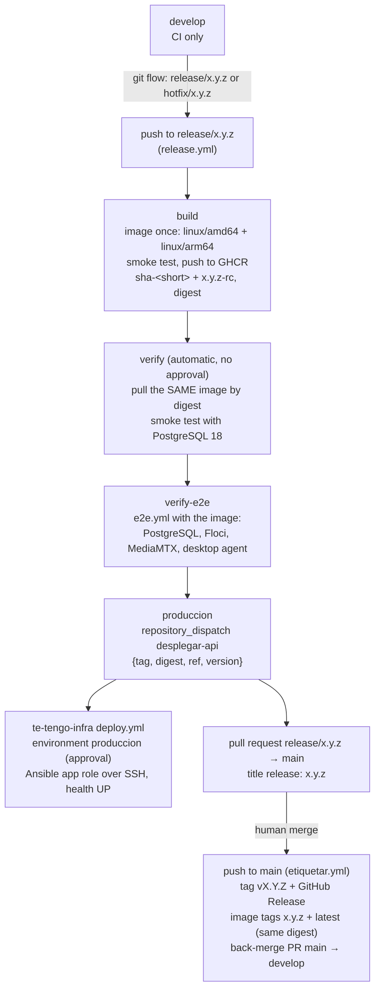

# Deployment: container image

The API ships as one container image, built by the [`Dockerfile`](../Dockerfile) and published to the GitHub Container Registry as `ghcr.io/te-tengo-tech/te-tengo-general-api`. The server setup (one Azure VM with Docker Compose: Caddy with TLS, PostgreSQL, MediaMTX; clips in Cloudflare R2) lives in `te-tengo-infra`; this document covers the image and how a release reaches that server.

## The image
- **Two stages.** A Temurin 25 JDK stage runs `./gradlew bootJar` and splits the jar into Spring Boot layers. The runtime stage is Temurin 25 **JRE** with one image layer per Spring Boot layer (dependencies, loader, snapshots, application), so a new release usually only pulls the small application layer.
- **Platforms.** `linux/amd64` (the production Azure VM) and `linux/arm64` (the inactive OCI Ampere and AWS Graviton alternatives of `te-tengo-infra`). The build stage runs on the build machine's platform, since the jar is platform independent, so a multi-platform build compiles once.
- **Non-root.** It runs as user `tetengo` (uid/gid `10001`) from `/app`.
- **Health.** Port `8080`. The image `HEALTHCHECK` probes `/actuator/health/liveness`; readiness is `/actuator/health/readiness`. The JRE image has neither curl nor wget, so the probe uses bash's `/dev/tcp`.
- **Memory.** `JAVA_TOOL_OPTIONS` sizes the heap at 75 % of the container memory limit and exits on `OutOfMemoryError`, so the restart policy brings it back. Override the variable to tune it.

## Running it
The configuration is the same set of environment variables listed in the [README](../README.md#configuration), plus Spring Boot's standard datasource variables. The JWT keys are files: mount them read-only and point to them.

```bash
docker build -t te-tengo-general-api .
docker run --rm -p 8080:8080 \
  -v "$PWD/.claves:/run/secrets/tetengo:ro" \
  -e TT_JWT_CLAVE_PUBLICA=file:/run/secrets/tetengo/publica.pem \
  -e TT_JWT_CLAVE_PRIVADA=file:/run/secrets/tetengo/privada.pem \
  -e SPRING_DATASOURCE_URL=jdbc:postgresql://<host>:5432/tetengo \
  -e SPRING_DATASOURCE_USERNAME=tetengo -e SPRING_DATASOURCE_PASSWORD=<password> \
  te-tengo-general-api
curl localhost:8080/actuator/health
```

- **Key permissions.** The container user (uid 10001) must be able to read the mounted keys: `chmod 644`, or `chown 10001` with `chmod 600`.
- **Without storage, e-mail or push variables,** clips use the in-memory fake and e-mail and push only log. Set `TT_CLIPS_*` (Amazon S3 or [Cloudflare R2](#clips-on-cloudflare-r2)), the e-mail provider (`TT_CORREO_PROVEEDOR=ses` with `TT_SES_*`, or `smtp` with `TT_SMTP_REMITENTE` and `SPRING_MAIL_*`, see [NOTIFICATIONS.md](NOTIFICATIONS.md#e-mail)), `TT_PUSH_PROVEEDOR` and its variables for the real services. On EC2, leave the AWS access keys blank: the AWS SDK picks up the instance role.
- **For the PWA** (the app's web build, e.g. on Cloudflare Pages or a custom domain): `TT_CORS_ORIGENES=https://te-tengo.pages.dev` (an origin, without the path), `TT_ENLACE_BASE=https://te-tengo.pages.dev/app/#`, `TT_PWA_URL=https://te-tengo.pages.dev/app/` and, with `sns`, `TT_SNS_ARN_WEB`. Outside this image, MediaMTX needs `MTX_HLSALLOWORIGINS=https://te-tengo.pages.dev` and the clips bucket a CORS rule for the same origin (`clips_cors_allowed_origins` in `te-tengo-infra`), since the browser reads both from another origin.
- **Against a local stack** (PostgreSQL and Floci on a Docker network), point the endpoints at the Floci container: `TT_CLIPS_ENDPOINT=http://floci:4566`, `TT_CLIPS_PATH_STYLE=true`, `TT_CLIPS_ACCESS_KEY=test`, `TT_CLIPS_SECRET_KEY=test`, `TETENGO_CLIPS_S3_CREARBUCKET=true`. Pre-signed URLs then use the `floci` host name, which only containers on that network resolve.

## Clips on Cloudflare R2
The S3 adapter works with [Cloudflare R2](https://developers.cloudflare.com/r2/) through R2's S3 API, configured as Cloudflare's [AWS SDK for Java example](https://developers.cloudflare.com/r2/examples/aws/aws-sdk-java/) does: region `auto` and the account's S3 endpoint. Clips still never pass through the API: the agent uploads with a pre-signed PUT URL (10 minutes) and the app reads with a pre-signed GET URL (5 minutes). R2 accepts pre-signed URLs that last from 1 second to 7 days ([Presigned URLs](https://developers.cloudflare.com/r2/api/s3/presigned-urls/)).

```bash
TT_CLIPS_BUCKET=te-tengo-clips
TT_CLIPS_REGION=auto
TT_CLIPS_ENDPOINT=https://<ACCOUNT_ID>.r2.cloudflarestorage.com
TT_CLIPS_PATH_STYLE=true
TT_CLIPS_ACCESS_KEY=<R2 API token access key ID>
TT_CLIPS_SECRET_KEY=<R2 API token secret access key>
```

- **Credentials.** Create an R2 API token with object read and write permission on the bucket and keep its keys in the server's secrets, never in the repository. The API only presigns, checks that a clip exists (`HeadObject`) and deletes clips; leave `crear-bucket` off and create the bucket in Cloudflare.
- **Endpoint.** Pre-signed URLs only work on the S3 API domain `<ACCOUNT_ID>.r2.cloudflarestorage.com`, not on a custom domain of the bucket ([Presigned URLs](https://developers.cloudflare.com/r2/api/s3/presigned-urls/)). The agent and the app reach it directly.
- **Checksums.** No extra SDK setting is needed. The pre-signed PUT URL signs only `Content-Type` and `Host` and carries no SDK checksum parameters, so the agent's plain PUT with the returned `Content-Type` header matches the signature; `AlmacenamientoDeClipsConfigTest` keeps that true across SDK upgrades. (Cloudflare's example disables chunked encoding for `PutObject` sent through the SDK client; the API never uploads through the client.)
- **CORS for the PWA.** The PWA reads clips from another origin, so the bucket needs a CORS policy for the PWA's origin ([Configure CORS](https://developers.cloudflare.com/r2/buckets/cors/)). In the dashboard (R2 > the bucket > Settings > CORS Policy), for example:
  ```json
  [
    {
      "AllowedOrigins": ["https://te-tengo.pages.dev"],
      "AllowedMethods": ["GET", "HEAD", "PUT"],
      "AllowedHeaders": ["Content-Type", "Range"],
      "ExposeHeaders": ["ETag"],
      "MaxAgeSeconds": 3600
    }
  ]
  ```
  `GET` and `HEAD` play and download clips; `PUT` with `Content-Type` covers a pre-signed upload from a browser (the household agent is not a browser, so CORS does not apply to it). Wrangler applies the same rule with `npx wrangler r2 bucket cors set <BUCKET_NAME> --file cors.json`, in its own file format (see the Cloudflare page).
- **Locally nothing changes:** the `local` profile keeps Floci's S3 on port 4566.

## Release flow (build once, deploy many)
Releases follow git flow and are promoted **from the release branch**: the image is built once, the same image (by digest) is verified in an ephemeral stack and then deployed to production, and `main` and the tag come **last**, after production was approved. Nothing is built or deployed on a push to `main`. The API has **no staging environment** (there is no second VM): the verification is automatic, and production has the only approval, in `te-tengo-infra`.



| Trigger | Workflow | What happens |
|---|---|---|
| Pull request touching the image inputs | [`image.yml`](../.github/workflows/image.yml) | Builds the amd64 image and smoke-tests it ([`scripts/smoke-image.sh`](../scripts/smoke-image.sh): it must migrate an empty PostgreSQL 18, report healthy and not run as root), then builds both platforms. Nothing is pushed |
| Manual run (*Actions → Container image → Run workflow*) | `image.yml` | Same build; with **push** checked (and `ENABLE_API_IMAGE` on), pushes `sha-<short commit>` and `<branch>` for tests. Never deployed by itself |
| **Push to `release/x.y.z` or `hotfix/x.y.z`** | [`release.yml`](../.github/workflows/release.yml) | The release pipeline below |
| Push to `main` (the merged release pull request) | [`etiquetar.yml`](../.github/workflows/etiquetar.yml) | Tag `vX.Y.Z` (version of `build.gradle.kts`) and a GitHub Release with the `CHANGELOG.md` section as notes (skipped if the tag exists); tags `X.Y.Z` and `latest` added to the `X.Y.Z-rc` image by digest (`docker buildx imagetools create`, no rebuild); back-merge pull request `main → develop` (`chore: merge release x.y.z back into develop`). **No deploy** |

### The release pipeline (`release.yml`)
| Job | Environment | What it does |
|---|---|---|
| `build` | none | Reads `version` from `build.gradle.kts` (a warning if the branch name differs), builds the image **once** for both platforms, smoke-tests the amd64 image, pushes it to `ghcr.io/te-tengo-tech/te-tengo-general-api` as `sha-<short commit>` and `<version>-rc` and records its **digest**. Its summary lists every switch |
| `verify` (*Verify release image (ephemeral)*) | none, no approval | An **ephemeral run in the runner**: pulls the same image **by digest** (and checks the digest), starts it with PostgreSQL 18 and runs the smoke test. Always runs when the image was pushed |
| `verify-e2e` | none (after `verify`) | Calls [`e2e.yml`](../.github/workflows/e2e.yml) with that image: `scripts/e2e.sh` with `TT_E2E_IMAGEN` runs the API container on the host network next to the `compose.yaml` stack (PostgreSQL, Floci, MediaMTX) and the real desktop agent, headless, and asserts the alert, its push, its confirmation, its clip and the live view authorization |
| `produccion` | none (the approval is in `te-tengo-infra`) | Sends `repository_dispatch` `desplegar-api` to `te-tengo-infra` with `client_payload` `{tag: "sha-<short>", digest, ref: "<full commit>", version}`. Needs `verify` and `verify-e2e` to pass. Fails with a clear error without the `DISPATCH_TOKEN` secret |
| `pull-request` | none | Opens the pull request `release/x.y.z → main` (title `release: x.y.z`) with `GITHUB_TOKEN`, listing what was deployed where, or updates its description when it is already open. Merging it is a human action (the `main` ruleset needs a review and the CI checks) |

- **Required checks of the release pull request.** A pull request opened with `GITHUB_TOKEN` starts no `pull_request` workflow, so CI also runs on pushes to `release/**` and `hotfix/**`; its checks belong to the same commit and satisfy the `main` ruleset.
- **Re-running.** A new push to the same release branch runs the pipeline again with a new image (new `sha-` tag; `<version>-rc` moves to it). Runs of one branch never overlap (concurrency group per branch) and a running one is never cancelled, since it may be deploying; a newer push waits and replaces an older run that has not started yet. The production approval itself happens in te-tengo-infra's Deploy run, where a reviewer can also reject it.
- **Preparing a release.** Branch `release/x.y.z` from `develop`, set `version = "x.y.z"` in `build.gradle.kts` and rename `[Unreleased]` in `CHANGELOG.md` to `[x.y.z] - <date>` (that section becomes the GitHub Release notes), push. Hotfixes branch from `main` as `hotfix/x.y.z`.
- **Authentication.** Pushing and tagging the image use the workflow's own `GITHUB_TOKEN` (`packages: write`); no secret is needed for the image. `docker/metadata-action` adds the OCI labels (source, revision, version, creation date); `org.opencontainers.image.source` links the package to this repository.
- **Tags.** Production deploys use the immutable `sha-<short commit>` tag, and the digest travels with it. `<version>-rc` points to the latest image built from the release branch; `X.Y.Z` and `latest` are added on `main` to that same digest.

### Switches
Each stage has an on/off switch: an **organization** Actions variable of `Te-Tengo-Tech` (*Settings → Secrets and variables → Actions → Variables*), the single control panel for every repository. They are explicit opt-in: only the value `true` turns a stage on, and an unset variable means off. The pull request build and smoke test always run. A stage that is off is skipped and the `build` job's summary says why. The verification jobs have no switch: they always run when there is an image. With the switches on, the deploy waits for an approval on infra's `produccion`.

| Variable | What it controls | Suggested value |
|---|---|---|
| `ENABLE_API_IMAGE` | Pushing the release image to GHCR (and the manual push of `image.yml`, and the `X.Y.Z`/`latest` tags of `etiquetar.yml`). Off: the image is only built and smoke-tested, and the verification and produccion are skipped (there is no image to pull) | `true` |
| `ENABLE_API_DEPLOY` | The `produccion` job (`repository_dispatch` `desplegar-api` to `te-tengo-infra`). `te-tengo-infra` gates its `Deploy` job with the same variable, so setting it to anything but `true` freezes production | `true` |

## Production deploy (release branch → approval in te-tengo-infra → Azure VM)
```
release.yml produccion: repository_dispatch "desplegar-api" to Te-Tengo-Tech/te-tengo-infra,
  client_payload {"tag": "sha-<short>", "digest": "sha256:...", "ref": "<full commit>", "version": "x.y.z"}
    └─ te-tengo-infra deploy.yml (on its main branch): checks that the tag still resolves to the digest,
       then the job in environment "produccion" ─► waits for a required reviewer ─► Ansible app role over SSH
       (te_tengo_api_source=registry, te_tengo_api_tag=sha-<short>) ─► /actuator/health is UP
```
- **Approval lives in `te-tengo-infra`.** Sending the request is not a deploy, so the `produccion` job here uses no GitHub environment; this repository's `produccion` environment would only add a second, redundant approval. The infra workflow pauses on its own `produccion` environment before it touches the VM ([te-tengo-infra `docs/deploy.md`](https://github.com/Te-Tengo-Tech/te-tengo-infra/blob/main/docs/deploy.md)).
- **Secret `DISPATCH_TOKEN`** (repository secret of this repository). A [fine-grained personal access token](https://docs.github.com/en/authentication/keeping-your-account-and-data-secure/managing-your-personal-access-tokens#creating-a-fine-grained-personal-access-token): resource owner **Te-Tengo-Tech**, *Only select repositories* → `te-tengo-infra`, repository permission **Contents: Read and write** (the permission the [`POST /repos/{owner}/{repo}/dispatches`](https://docs.github.com/en/rest/repos/repos#create-a-repository-dispatch-event) endpoint requires, per [Permissions required for fine-grained personal access tokens](https://docs.github.com/en/rest/authentication/permissions-required-for-fine-grained-personal-access-tokens)); *Metadata: Read* is added automatically. Set an expiry and renew it. If the organization requires approval of fine-grained tokens, an owner approves it first. Without the secret the `produccion` job fails with an error; add it and re-run the job, or run infra's *Deploy* by hand with the tag.
- **The infra workflow must be on infra's `main`.** GitHub only starts a `repository_dispatch` workflow from the file on the default branch, and runs it on that branch ([Events that trigger workflows](https://docs.github.com/en/actions/reference/workflows-and-actions/events-that-trigger-workflows#repository_dispatch)).
- **Rollback.** Run infra's *Deploy* by hand with the previous `sha-<short>` tag (each run's summary names its tag and digest).

### One-time steps after the first push
1. **Check the link to this repository.** The `org.opencontainers.image.source` label links the package automatically: check the package page under the organization's *Packages* tab.
2. **Make the package public, once.** The production VM pulls without credentials (`te_tengo_registry_auth: none` in `te-tengo-infra`). Although this repository is public, the package does **not** become public with it: GitHub's documentation says a package linked to a repository "inherits the access permissions (but not the visibility) of the linked repository", and that a newly published package is private ([Configuring a package's access control and visibility](https://docs.github.com/en/packages/learn-github-packages/configuring-a-packages-access-control-and-visibility)). So, after the first push: *github.com/orgs/Te-Tengo-Tech/packages/container/package/te-tengo-general-api → Package settings → Danger Zone → Change visibility → Public*, and confirm with the package name. An organization owner may first need to allow public packages (*Organization settings → Packages*). This cannot be undone: a public package cannot be made private again. Check it without credentials: `docker logout ghcr.io; docker pull ghcr.io/te-tengo-tech/te-tengo-general-api:<version>-rc`.
   - Keeping it private instead means `te_tengo_registry_auth: login` with a `read:packages` token in the infra vault. The verification jobs here log in with `GITHUB_TOKEN`, so they work either way.
3. **Pin the version on the server.** Deploys reference an immutable `sha-<short commit>` tag (or a release tag), never `:latest` or `:<version>-rc`, so a deployment is reproducible and can be rolled back.
